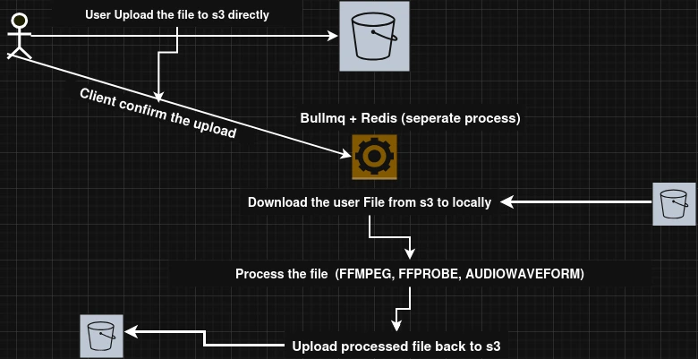

# Media Processing Backend System

This project is a **backend data-processing pipeline** for audio and video files, built with **Express.js**. Users can upload files directly to **S3** using pre-signed URLs, and files are processed asynchronously using **BullMQ + Redis workers**. The pipeline handles format conversion, metadata extraction, waveform generation, and uploads the processed files back to S3.

---

## Architecture Overview



---

## Demo

https://github.com/user-attachments/assets/1785c7e2-6bd2-4204-83e2-1e9cbc3faa32

---

## Features

* Direct **S3 uploads via pre-signed URLs**
* Automatic **worker triggering** after file upload
* Audio **format conversion** (e.g., MP3/AAC)
* **Metadata extraction** from audio/video files
* **Waveform generation** stored as JSON
* Processed files and waveform JSON are uploaded back to S3
* Asynchronous processing with **BullMQ** + **Redis**

---

## Prerequisites

Make sure the following are installed:

* [Node.js](https://nodejs.org/en/)
* [npm](https://www.npmjs.com/)
* [FFmpeg](https://ffmpeg.org/download.html)
* [audiowaveform](https://github.com/bbc/audiowaveform)
* Redis server

---

## Installation

```bash
npm install
```

---

## Usage

### Run Backend Server

```bash
npm run dev
```

### Run Worker (separate Node process)

```bash
npm run worker
```

### Prisma Setup

```bash
npx prisma generate
npx prisma db push
```

### Linter & Formatter

```bash
npm run lint
npm run lint:fix
npm run format
```

> Make sure Redis is running before starting the worker.
> FFmpeg and audiowaveform must be installed and available in your system PATH.

---

## Workflow

1. Client requests a **pre-signed URL** from the backend
2. Client uploads the file directly to **S3**
3. A **worker** picks up the uploaded file
4. Worker downloads the file locally (required by FFmpeg)
5. Extracts **metadata** using FFprobe
6. Generates a **mute video** from the original video
7. Extracts **audio-only** track and converts to **AAC format**
8. Generates **waveform JSON** for the audio
9. Uploads processed files back to **S3**
10. Saves all **metadata and S3 keys** in the database

---
Love it! Give it a star ⭐
---
