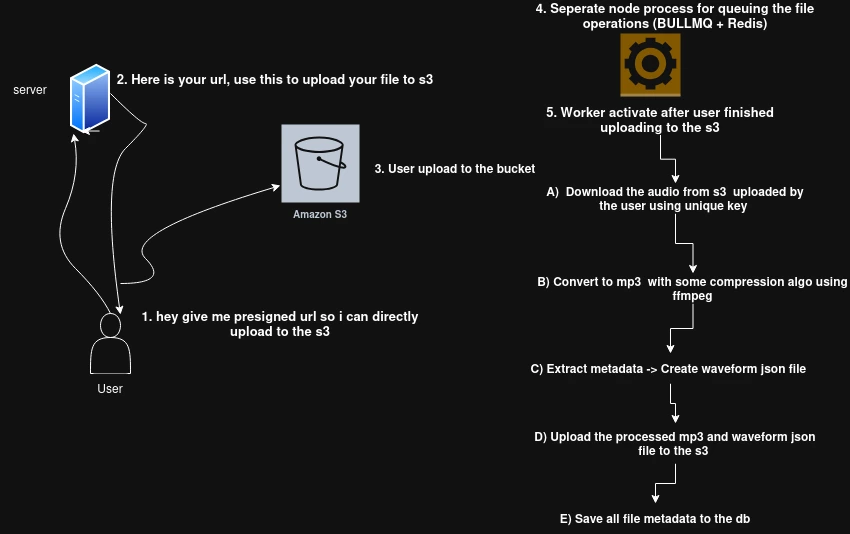

# Audio Processing Backend System

This project is a backend data-processing pipeline for audio files, built with Express. It allows users to upload audio directly to S3, then processes those files asynchronously using BullMQ + Redis workers. Once triggered, the pipeline downloads the audio, performs format conversion, metadata extraction, and waveform JSON generation, and finally uploads the processed MP3 and waveform data back to S3.

---

## Architecture Overview

---

## Features

- Direct **S3 uploads via pre-signed URLs**.
- Automatic **triggering of workers** after file upload.
- Audio **format conversion** to MP3 (if required).
- **Metadata extraction** from audio files.
- **Waveform generation** stored as JSON.
- Processed files and waveform JSON are uploaded back to S3 with server-generated keys.
- Asynchronous processing using **BullMQ** and **Redis**.

---

## Prerequisites

Before running the project, ensure you have the following installed:

- [Node.js](https://nodejs.org/en/)
- [npm](https://www.npmjs.com/)
- [FFmpeg](https://ffmpeg.org/download.html)
- [audiowaveform](https://github.com/bbc/audiowaveform)
- Redis server

---

## Installation
`npm install`

### Usage
##### Run Backend Sever
`npm run dev`

##### Run Worker (seperate node process)
`npm run worker`

### Prisma setup
`npx prisma generate`

`npx prisma db push`

### Linter
`npm run lint:fix`

`npm run format`

---

> Note: Make sure Redis server is running before starting the worker.
FFmpeg and audiowaveform must be installed and available in the system PATH.

---

#### Workflow

1. User requests a **pre-signed URL** for uploading audio.

2. User uploads the file **directly to S3**.

3. After upload, **worker is triggered** via Redis/BullMQ queue.

4. Worker **downloads the file from S3** to local storage.

5. Audio file is processed:

    - Converted to MP3 (if necessary)

    - Metadata is extracted

    - Waveform JSON is generated

9. Processed MP3 and waveform JSON are uploaded back to S3.
---